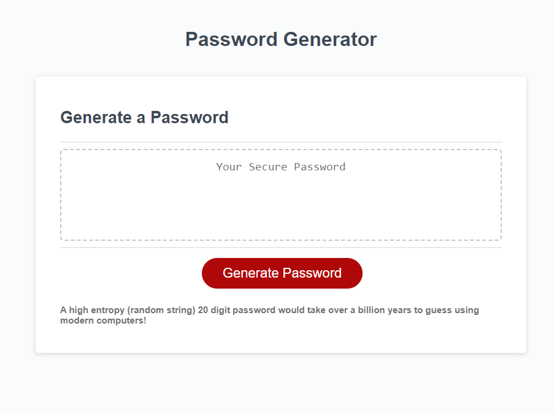
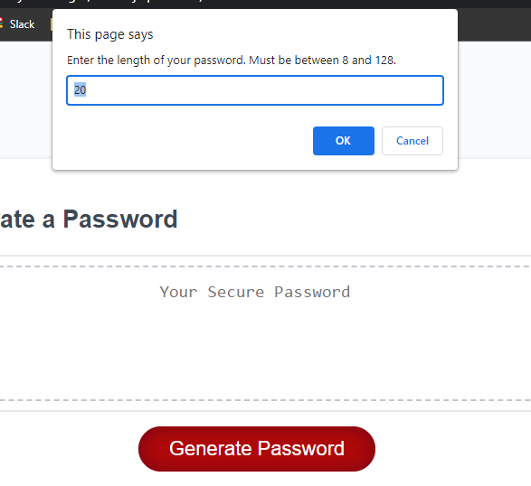
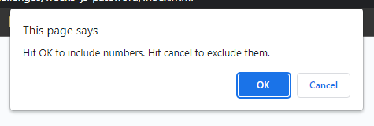
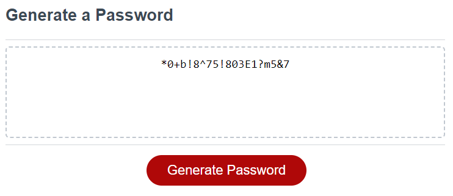

# Week 3: Javascript Password Generator

## Descritpion

For our third weekly assignment for our web development program, we were tasked with adding functionality to an already existing page. We were given some starter HTML that had been styled using CSS, as well as a rudimentary script file. Our task was to add a function to the "Generate Password" button that produced a random string of characters based on several parameters set by the user.

The goal of this project was to get our hands dirty with Javascript, getting a good handle on the syntax, variables, arrays, and how to utilize conditional statements.

For my approach, I grouped all lower case letters, a handful of symbols, and numbers into their own array each. Then each of them would only be added to a "Master Array" if a conditional statement was met (lower case letters were part of the master array by default). An example being, if you chose not to include numbers, but wanted to include special characters, only the special characters array would be pushed.

Backtracking a step, the first prompt asks for the desired length of the password, asking for a number between 8 and 128. In order to deny any progress if the user inputted a number not within this range, or if the user decided to type "square" or something, there are several checks that trigger while() loops until a proper number is input.

Then the rest isn't very complicated, just a for () loop with the desired length as the one the user chose, and then two Math.random checks that picks a random array from the master array, and then a random string from the chosen array. Everything's kept within range using array.length as the max number that can be generated. Then, whatever character is picked is concatenated onto the in progress password.

Finally, the password is displayed to the page using a querySelector.

But wait! All that may have been in the project guidelines, but seeing as we just learned about quereySelectors and timers, why not do some extra credit? So as a bonus, I made a cute little timer function that pushes some tips and trivia to the page every 5 seconds. Although making it so the same tip didn't appear twice in a row was a hassle, so there's still that bug to squash. Also I could only think of 3 tips/bits of trivia and I had already coded for there to be 4 tips.

## Installation 
N/A Already deployed on GitHub pages.
https://tannerkothlow.github.io/javascript-password-generator/

## Usage
Usage couldn't be any easier, just hit the big red button and pick what characters you want included, if you want capital letters, and presto! A brand new password to call your very own.

The prompts will look like this, simply enter how long you want your password to be into the first prompt, and then either confirm (OK) or decline (Cancel) to the next couple prompts.

Once done, highlight your new password and hit CTRL + C on your keyboard to copy it. Then use CTRL + V to paste it.

## License
Starter code provided by UofM Coding Bootcamp Instructors.
Standard MIT license, coursework.
